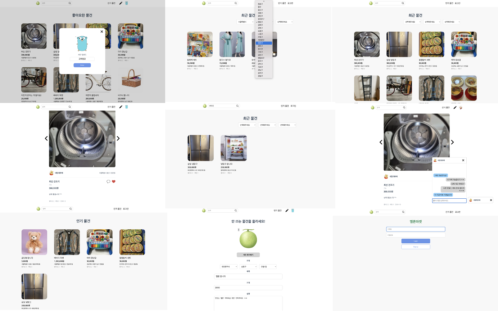

# melon-market

멜론마켓은 중고거래 플랫폼인 '당근마켓을' 참고하여 만든 모작입니다.  
특정 지역을 선택해 물품을 등록하면 리스트 화면에서 지역 필터링을 통해 원하는 동네의 물건을 찾을 수 있습니다.
관심있는 물건에는 좋아요를 눌러 한꺼번에 모아 볼 수 있고, 채팅 메시지를 보내 판매자와 대화를 나눌 수도 있습니다.

### 사용 기술

Backend - java, spring boot, websocket, rabbitmq  
Database - mysql, redis  
Front - javascript, vue, socketjs  
Etc - git, git action

### 주요 기능

* 로그인 및 회원가입 - spring security 를 통한 사용자 인증 관리  
* 지역 데이터 패치 - 정부가 제공하는 tsv 형식의 지역 데이터를 하루에 한 번 spring batch 를 이용해 가져와 데이터베이스에 저장  
* 지역 기반 필터링과 제목 검색 - 데이터 베이스에 있는 지역 코드를 기반으로 동네 물건 검색  
* 조회수 기록 - 상세 화면을 볼 때마다 조회수 갱신. 세션을 이용해 중복되어 조회수가 기록되지 않도록 처리  
* 인기 매물 검색 - redis 에 최근 사용자들이 본 물건들을 기록하고 인기 매물 검색시 redis 에서 데이터를 가져와 응답  
* 좋아요 및 채팅 수 기록 - 물건마다 좋아요를 한 사람의 숫자와 채팅 메시지를 나눈 사람의 숫자를 기록해 보여줌  
* 채팅 기능 - websocket 를 이용해 판매자와 실시간 채팅이 가능하도록 구현  
* 채팅 저장 - 채팅 저장으로 인해 실시간 채팅이 지연되는 현상을 방지하기 위해 rabbitmq 로 채팅 데이터를 보내 저장  

* 테스트 - controller, service, repository 단위의 테스트 작성  
* Github action - push 시 자동으로 빌드 및 테스트를 수행하고 에러 시 메일을 받도록 함

* 